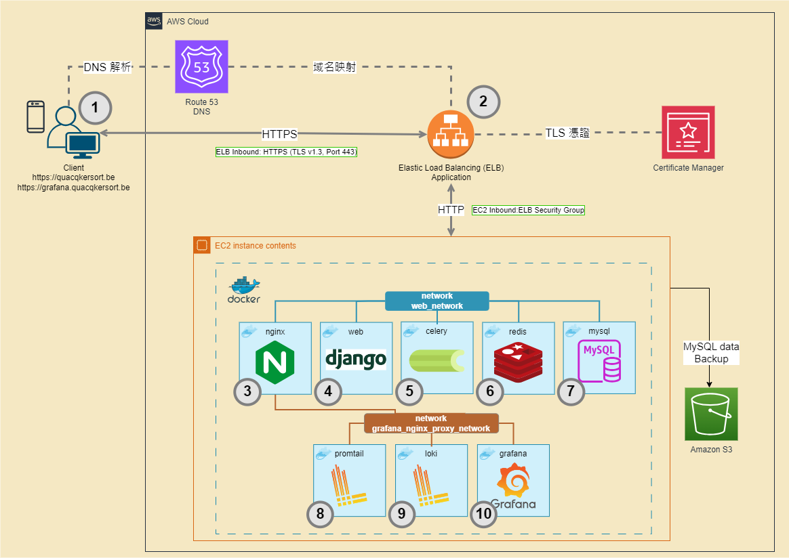

<h1 align="center" style="margin-bottom: -10px;">
  
  <br>
  Quacqkersort
</h1>

<h3 align="center">
  Aligning Tasks and Teams
</h3>

<p align="center">
    <a href="https://quacqkersort.be/login/">View Quacqkersort Web</a>
    ·
    <a href="https://grafana.quacqkersort.be">View Grafana Dashboard</a>
    ·
    <a href="https://github.com/MaiSharon/Employee-Management-System/issues">Report Bug</a>
</p>

<p align="center">
  
  
  
</p>

<p align="center">
  
  
</p>

<details>
  <p align="center">
    <summary>查看更多細節截圖</summary>
    
    
    
    
    
    
    
  </p>
</details>

## 架構圖
<p align="center">
  
</p>

## 專案介紹
Quacqkersort 是專為公司內部管理層設計的開源專案，提供專屬管理層對話空間、記錄員工行政事務、管理手機設備，以及任務分配。  
特點包括實時聊天、一致的開發至生產環境、容器化管理，以及開放的子網域可訪問監控系統面板。


## 技術棧
### Backend
* Python3.9 & Django4.1
* MySQL
* Django-Channel & Websocket
* Redis
* Celery
* Flower
* Docker & Docker Compose

### Frontend
* HTML
* JavaScript
* fetch(API交互)
* Bootstraps5
* MBD(Material Design for Bootstrap)

## 功能與操作示範
* 註冊與信箱驗證
* 登入與登出
* 實時顯示管理員在線狀態
* 實時更新註冊成功管理員，添加到管理員列表中
* 聊天室
* 表單的增加、刪除、修改和搜索
  * 部門
  * 員工數據
  * 手機設備
* 任務管理實時顯示的增加、刪除、修改和搜索


## 設計模式與字串文檔
### 設計模式
* 主要使用 Function-Based Views (FBV)
* 輔以 Class-Based Views (CBV)
* 輔以 Restful API
### 字串文檔
- API 遵循 Swagger 規範自動生成文檔
- 主要遵循 Google Python Style Docstring
- 部份基於 Google Python Style Docstring 上微調。
    - 添加請求方式與流程，提高文檔的直觀性。例如：
    ```python
    """
    處理用戶註冊請求。

    - GET: 返回空白註冊表單(AdminModelForm)。
    - POST: 處理提交的註冊數據以創建新用戶。

    Steps for GET: 創建並渲染空的 AdminModelForm。

    Steps for POST:
        1. 驗證註冊表單。
        2. 若驗證成功
            2.1. 創建並保存新的 Admin 對象。
            2.2. 發送驗證信給新用戶。
            2.3. 發送新用戶的數據到 WebSocket。
            2.4. 記錄創建操作，返回註冊頁面。
        3. 若驗證失敗
            3.1. 記錄操作，顯示錯誤信息並重渲染表單。

    Args:
        request (HttpRequest): 客戶端 HTTP 請求。

    Returns HttpResponse:
        - GET: 渲染過的註冊頁面，含空白 AdminModelForm。
        - POST:
            - 成功，重定向註冊頁面，含收信提示訊息。
            - 失敗，重渲染註冊頁面，含錯誤信息和空白 AdminModelForm。
    """
    ```
## 配置管理
* 配置分離: base.py、dev.py 和 prod.py 分別管理共享、開發和生產環境的配置。
* 敏感數據管理: 使用 .env.dev、.env.test 和 .env.prod 管理不同環境的敏感信息。

## 開發、測試與生產環境
### 開發環境
* 使用容器化的服務，包括 MySQL、Redis、Celery、Flower。
* 本地 Django 運行
  * 使用 dev.py 設定配置。
  * Django Debug Tools 進行開發調試。


### 測試環境
* 使用 Docker Compose 運行
  * 使用容器化的服務，包括 Web(Django)、MySQL、Redis、Celery 和 Ngrok。
  * 使用 prod.py 設定配置
  * 使用 Ngrok 的 HTTPS 臨時網域模擬生產環境。

### 生產環境
* AWS EC2: 應用部署和計算。
  * 使用 SSH 密鑰進行安全連接。
  * Docker Compose: 容器化服務管理。
    * 運行容器化服務，包括 Web(Django)、MySQL、Redis、Celery 和 Nginx。
  * Nginx: 反向代理和監控系統訪問。
* AWS Route 53: DNS 管理和 HTTPS 配置。
* AWS Certificate Manager (ACM): TLS/SSL 證書。
* AWS 安全組: 流量限制和安全加固。
* AWS ELB: 管理 HTTPS 流量和負載平衡。
* AWS S3: 數據庫的定期備份。

## 監控系統和日誌
### 監控系統
- **容器化的監控工具**: 使用 Docker 來容器化 Promtail、Loki 和 Grafana，系統監控和日誌分析。
- **Grafana Dashboard**: 透過 Grafana 提供的可視化儀表板，實現即時監控和數據分析。

### 日誌管理
- **日誌格式設定**: 使用 Logging 設定日誌格式。
- **開發環境**: 使用實體文件存儲日誌，方便開發時的查詢和調試。
- **生產環境**: 使用 Docker Volume 存儲日誌，確保日誌的持久性。

## TODO List
* [完成] 修改task 任務新增的BUG
* 加入緩存使用 Redis
* task 寫單元測試
* [完成] 中間件 auth 寫單元測試
* admin 的搜尋不影響聊天室
* [完成] 加入 Celery 配置提升用戶體驗
* 生產環境下的 Celery 監控 flower 配置
* 加入 jenkins 實現 CI/CD


