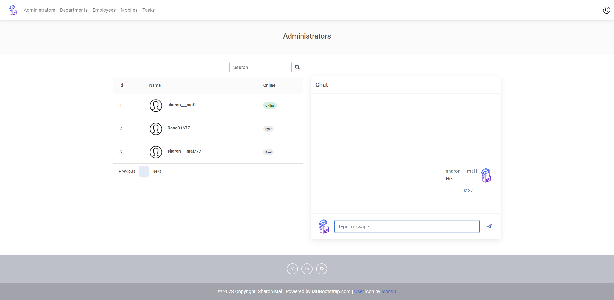

<h1 align="center" style="margin-bottom: -10px;">
  
  <br>
  Quacqkersort
</h1>

<h3 align="center">
  Aligning Tasks and Teams
</h3>

<p align="center">
    <a href="https://quacqkersort.be/login/">View Quacqkersort Web</a>
    ·
    <a href="https://grafana.quacqkersort.be">View Grafana Dashboard</a>
    ·
    <a href="https://github.com/MaiSharon/Employee-Management-System/issues">Report Bug</a>
</p>

<p align="center">
  
  
  
</p>

<p align="center">
  
  
</p>

<details>
  <p align="center">
    <summary>查看更多細節截圖</summary>
    
    
    
    
    
    
    
  </p>
</details>

## 架構圖
<p align="center">
  
</p>
## 專案介紹

Quacqkersort 是專為公司內部管理層設計的開源專案，提供專屬管理層對話空間、記錄員工行政事務、管理手機設備，以及任務分配。  
特點包括實時聊天、一致的開發至生產環境、容器化管理，以及開放的子網域可訪問監控系統面板。


## 技術棧
### Backend
* Python3.9 & Django4.1
* MySQL
* Django-Channel & Websocket
* Redis
* Docker & Docker Compose

### Frontend
* HTML
* JavaScript
* Bootstraps5
* MBD

## 功能與操作示範
* 註冊與信箱驗證
* 登入與登出
* 實時顯示管理員在線狀態
* 聊天室
* 員工資料的增加、刪除、修改和搜索


## 設計模式與文檔風格
### 設計模式
* 主要使用 Function-Based Views (FBV)
* 輔以 Class-Based Views (CBV)
### 文檔風格
- 基於 Google Python Style Docstring 上微調。
    - class 中增加 Main features 小節，列出了函數的核心功能，提高文檔的直觀性。
    ```python
    """
        驗證用戶輸入的搜尋字符串，並記錄相關的日誌信息。
    
        Main features：
        - 檢查輸入長度不可超過20個字符。
        - 只允許包含大小寫字母、數字、下劃線和點。
        - 日誌: 記錄調用此函數的文件和行號
        - 日誌: 記錄輸入字符串包含驗證未通過與通過的。
    
        Args:
            search_input (str): 接收用戶輸入的字符串。
    
        Returns:
            str: 當輸入通過驗證->返回原始輸入字符串；否->返回空字符串。
    
    """
    ```
## 配置管理
* 配置分離: base.py、dev.py 和 prod.py 分別管理共享、開發和生產環境的配置。
* 敏感數據管理: 使用 .env.dev、.env.test 和 .env.prod 管理不同環境的敏感信息。

## 開發、測試與生產環境
### 開發環境
* 本地 Django 運行，使用 dev.py 配置。
* Django Debug Tools 進行開發調試。
* Docker 容器運行 MySQL 和 Redis。

### 測試環境
* 使用 Docker Compose 和 YAML 配置，實現服務的容器化，包括 Web、MySQL、Redis 和 Ngrok。
* 使用 Ngrok 的 HTTPS 臨時網域模擬生產環境。

### 生產環境
* AWS EC2: 應用部署和計算。
* AWS Route 53: DNS 管理和 HTTPS 配置。
* AWS Certificate Manager (ACM): TLS/SSL 證書。
* AWS 安全組: 流量限制和安全加固。
* AWS ELB: 管理 HTTPS 流量和負載平衡。
* Docker Compose: 容器化服務管理。
* Nginx: 反向代理和監控系統訪問。
* AWS S3: 數據庫的定期備份。

## 監控系統和日誌
### 監控系統
- **容器化的監控工具**: 使用 Docker 來容器化 Promtail、Loki 和 Grafana，系統監控和日誌分析。
- **Grafana Dashboard**: 透過 Grafana 提供的可視化儀表板，實現即時監控和數據分析。

### 日誌管理
- **日誌格式設定**: 使用 Logging 設定日誌格式。
- **開發環境**: 使用實體文件存儲日誌，方便開發時的查詢和調試。
- **生產環境**: 使用 Docker Volume 存儲日誌，確保日誌的持久性。

## TODO List
* task 任務新增的BUG
* task 寫單元測試
* admin的搜尋不影響聊天室
* 加入 celery 配置提升用戶體驗
* 加入 redis 配置加快載入速度
* 加入 jenkins 實現 CI/CD


